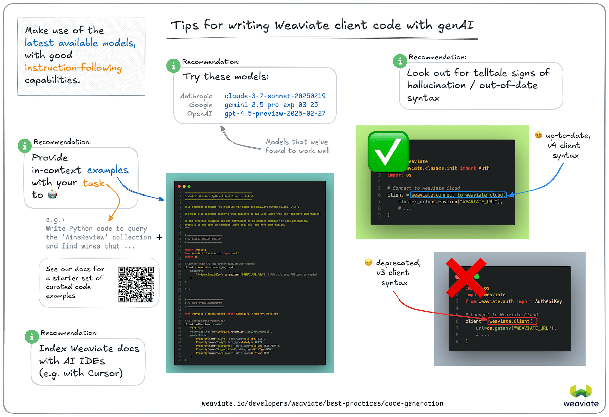

# AI-based Weaviate code generation

Generative AI models are becoming more capable at writing code. While this can speed up development, it is also subject to some pitfalls, such as hallucinations due to out-of-date, or missing information in the training data.

Here are some tips for writing Weaviate client library code with generative AI models and tooling, based on our anecdotal experience.

## Specific recommendations

### High-performing models

As of April 2025, we've seen these models perform well for code generation. (Assessed by the correctness of the [Python v4 client library](/developers/weaviate/client-libraries/python/index.md) code generation.)

- Anthropic `claude-3-7-sonnet-20250219`
- Google `gemini-2.5-pro-exp-03-25`
- OpenAI `gpt-4.5-preview-2025-02-27`

If you are using the Python client library, we recommend that you try out one of the above models to see if it performs well for your use case.

Although none of these models performed perfectly at zero-shot code generation tasks (i.e. with only a description of the task), they were able to generate correct code most of the time when provided with in-context examples.

### In-context code examples

We found that for Weaviate Python client library code generation, performances of the above LLMs improved significantly when provided with in-context examples.

As a starting point, we have curated a set of code examples below. Try copy and pasting these into your prompt.

import CodeExamples from '!!raw-loader!/_includes/code/python/best-practices.python.ai.py';
import CodeBlock from '@theme/CodeBlock';

  <CodeBlock language="python">{CodeExamples}</CodeBlock>

 

If the above code examples are not sufficient, you can try the following:

1. Collect code examples from relevant sections of the Weaviate Documentation.
1. Use the `Ask AI` feature in the Weaviate Documentation to find examples of how to perform specific tasks. Then, use the provided code in your prompt.

## General tips

Along with the specific recommendations above, we also have the following general tips:

### Use the latest models

You may already have a preferred model provider. Try out the latest models to see if they perform better for your use case.

Later models will be trained on more recent data, and are likely to be better at zero-shot code generation tasks. This is particularly important where the code base has been significantly updated, such as with the Weaviate Python client, which was rewritten in 2024.

### Look for better instruction-following models

Some models are better at following instructions provided as in-context examples.

These models are more likely to respect up-to-date examples provided as in-context instructions.

### Index further documentation

Some AI-powered code generation tools such as Cursor allow you to index further documentation. This can be a great way to get more context for the code generation task.

Review the documentation of your specific IDE to see if it has this feature.

## Help us improve this page

The above recommendations are based on our experience using generative AI models for code generation.

In order to collect data for this page in a systematic way, we ran a series of experiments through [this repository](https://github.com/weaviate-tutorials/weaviate-vibe-eval).

The test were carried out by generating code for the Weaviate Python client v4 using various LLMs, and assessing whether the code was able to run successfully. Each task was carried out multiple times, once as a zero-shot task, and at least once with in-context examples.

A sampling of the results are collected [in this directory](https://github.com/weaviate-tutorials/weaviate-vibe-eval/tree/main/example_results).

If you have any questions or feedback, please let us know by opening an issue on [GitHub](https://github.com/weaviate-tutorials/weaviate-vibe-eval/issues).

## Questions and feedback

import DocsFeedback from '/_includes/docs-feedback.mdx';

<DocsFeedback/>
